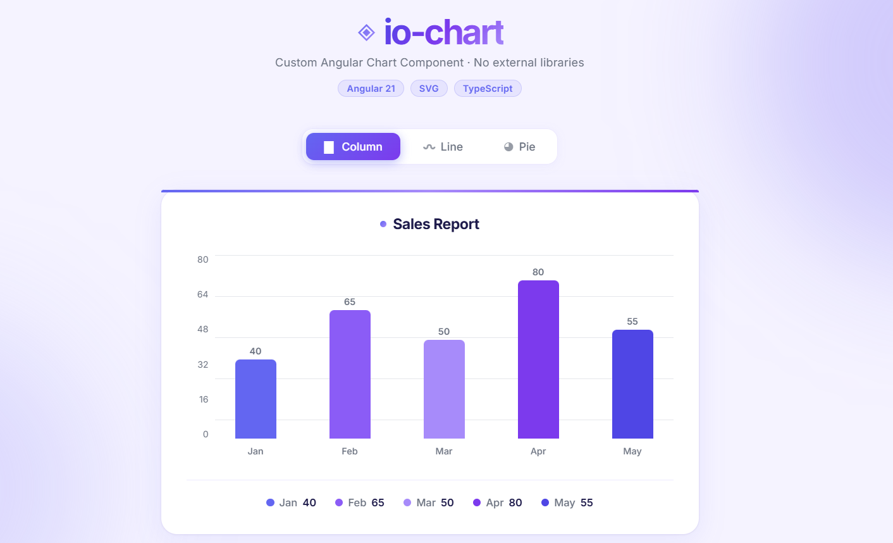
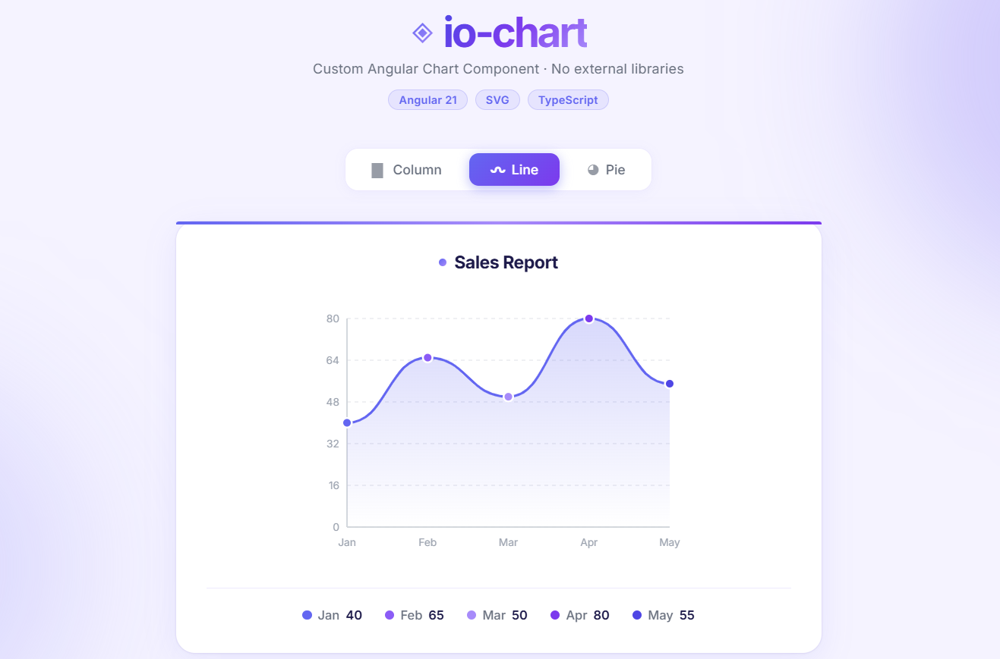
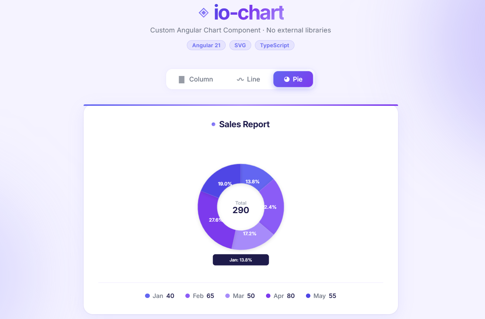

<p align="center">
  
  
  
  
  
</p>

<h1 align="center">📊 io-chart</h1>

<p align="center">
  A reusable, standalone Angular chart component — built with <strong>zero external charting libraries</strong>.<br/>
  Drop it in. Pass data. Get beautiful charts.
</p>

---

## ✨ Features

- **3 Chart Types** — Column, Line (bezier), Pie (donut arc)
- **Single Input API** — one `[chartOptions]` object drives everything
- **Zero Dependencies** — pure Angular + SVG + CSS, no Chart.js, no D3
- **OnPush Change Detection** — performant by default
- **Hover Tooltips** — on bars, line dots, and pie slices
- **Animated** — bars grow up, line draws in, pie fades in on load
- **Legend** — auto-generated color-coded legend per chart
- **Responsive** — mobile-friendly with CSS breakpoints
- **Accessible** — ARIA `role` and `aria-label` on all SVG elements

---

## 🚀 Quick Start

### Prerequisites

- [Node.js](https://nodejs.org/) v18+
- [Angular CLI](https://angular.dev/tools/cli) v21+

```bash
npm install -g @angular/cli
```

### Installation

```bash
# Clone the repository
git clone https://github.com/Codeguruu03/io-chart-project.git
cd io-chart-project

# Install dependencies
npm install

# Start the dev server
ng serve
```

Open your browser at **http://localhost:4200**

---

## 📦 Usage

Import `ChartComponent` into any standalone Angular component:

```typescript
import { Component } from '@angular/core';
import { ChartComponent } from './chart/chart.component';
import { ChartOptions } from './chart/chart.models';

@Component({
  standalone: true,
  imports: [ChartComponent],
  template: `<io-chart [chartOptions]="options"></io-chart>`
})
export class MyComponent {
  options: ChartOptions = {
    type: 'column',
    title: 'Monthly Revenue',
    series: [
      { name: 'Jan', value: 120, color: '#6366f1' },
      { name: 'Feb', value: 85,  color: '#a78bfa' },
      { name: 'Mar', value: 200, color: '#7c3aed' },
      { name: 'Apr', value: 160, color: '#8b5cf6' },
    ]
  };
}
```

---

## 📐 API Reference

### `<io-chart>` Inputs

| Input | Type | Required | Description |
|---|---|---|---|
| `chartOptions` | `ChartOptions` | ✅ | Complete chart configuration object |

### `ChartOptions`

```typescript
interface ChartOptions {
  type:   'line' | 'column' | 'pie';  // Chart type to render
  title:  string;                      // Displayed above the chart
  series: ChartSeries[];               // Data points
}
```

### `ChartSeries`

```typescript
interface ChartSeries {
  name:  string;   // Label shown on axes, legend, and tooltips
  value: number;   // Numeric value — drives bar height / line Y / pie slice size
  color: string;   // CSS color (hex, rgb, hsl, named — anything works)
}
```

### Example Input — All Chart Types

```typescript
// Column Chart
{ type: 'column', title: 'Sales Q1', series: [
  { name: 'Jan', value: 120, color: '#6366f1' },
  { name: 'Feb', value: 85,  color: '#a78bfa' },
]}

// Line Chart
{ type: 'line', title: 'User Growth', series: [
  { name: 'Week 1', value: 30,  color: '#6366f1' },
  { name: 'Week 2', value: 70,  color: '#6366f1' },
  { name: 'Week 3', value: 120, color: '#6366f1' },
]}

// Pie / Donut Chart
{ type: 'pie', title: 'Traffic Sources', series: [
  { name: 'Organic', value: 60, color: '#6366f1' },
  { name: 'Paid',    value: 25, color: '#a78bfa' },
  { name: 'Direct',  value: 15, color: '#7c3aed' },
]}
```

---

## 📊 Chart Types

### Column Chart
Vertical bars scaled proportionally to the maximum value.

- Dynamic bar height: `barHeight = (value / maxValue) × 200px`
- Y-axis with 6 evenly-spaced tick labels
- Dashed horizontal grid lines
- Value label above each bar
- Hover → brightness boost + value tooltip

### Line Chart
Smooth cubic bezier curve connecting all data points.

- **Smooth path** using midpoint control points — not a jagged polyline:
  ```
  C (cpX, prev.y), (cpX, curr.y), (curr.x, curr.y)
  ```
- Gradient area fill under the line (SVG `linearGradient`)
- X and Y axes with tick labels
- Colored dots at each data point
- Hover → vertical indicator line + tooltip popup

### Pie / Donut Chart
Mathematically precise arc segments using SVG arc commands.

- **Arc math** — each slice is a proper donut path:
  ```
  M (outer start) → A (outer arc) → L (inner end) → A (inner arc reversed) → Z
  ```
- Large arc flag determines which way the arc sweeps: `largeArc = angle > π ? 1 : 0`
- Donut hole with total value in center
- Hover → CSS `transform: scale(1.05)` on the slice group
- Percentage labels inside slices ≥ 8%

---

## 🏗️ Project Structure

```
src/
├── styles.scss                    # Global CSS variables & design tokens
├── main.ts                        # Bootstrap entry point
└── app/
    ├── app.component.ts           # Root component — sample data & type switcher
    ├── app.component.html         # App shell template
    ├── app.component.scss         # App shell styles & animations
    └── chart/
        ├── chart.component.ts     # All chart logic & SVG math helpers
        ├── chart.component.html   # SVG templates for all 3 chart types
        ├── chart.component.scss   # Chart styles, animations, hover effects
        └── chart.models.ts        # ChartOptions & ChartSeries interfaces
```

---

## 🧠 Design Decisions

### Why `ChangeDetectionStrategy.OnPush`?
Angular's default change detection checks every component on every event. `OnPush` restricts re-renders to only when `@Input()` references change — making the component performant at scale. Mouse events trigger `ChangeDetectorRef.markForCheck()` explicitly.

### Why cache `pieSlices` in `ngOnChanges`?
Calling `getPieSlices()` inside an `*ngFor` in the template means Angular recomputes all slice objects on every render cycle. When `activePieIndex` changes (on hover), this would recreate DOM nodes mid-hover, firing `mouseleave` immediately — causing slices to flicker/disappear. Caching slices as a property removes this entirely.

### Why SVG `transform: scale` for pie hover, not path swapping?
`transition: d` (animating SVG `d` attribute changes) is **not supported** in most browsers. Swapping the path `d` attribute on hover causes the element to disappear during the transition. CSS `transform: scale(1.05)` on the `<g>` group is GPU-accelerated and works across all browsers.

### Why cubic bezier for the line chart?
A standard `<polyline>` produces sharp angles at each data point. Cubic bezier curves with midpoint control points produce a smooth, natural-looking curve with zero overshoot — matching professional charting tools.

---

## 🛠️ Tech Stack

| Technology | Purpose |
|---|---|
| **Angular 21** | Component framework |
| **TypeScript 5** | Type-safe data models and logic |
| **SVG** | Chart rendering (paths, arcs, lines, text) |
| **SCSS** | Component styles, animations, CSS variables |
| **Inter** | Typography (Google Fonts) |

---

## 📝 Scripts

```bash
ng serve        # Start dev server at localhost:4200
ng build        # Production build to dist/
ng test         # Run unit tests
ng build --watch  # Dev build with file watching
```

---

## 📸 Screenshots

| Column Chart | Line Chart | Pie / Donut Chart |
|---|---|---|
|  |  |  |

---

## 📄 License

MIT © 2025 Naman

---

<p align="center">
  Built with ❤️ using pure Angular — no chart libraries harmed
</p>
